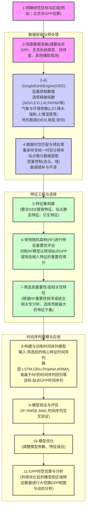
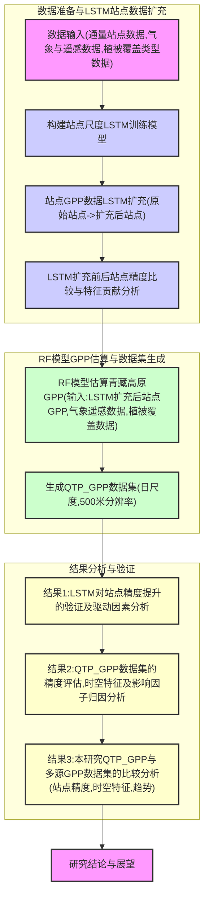

------------------------------------------------------------------------------------------

## 1. **最少参数（基础版）**

如果你只想用**最基础的遥感+气象参数**，以时间序列算法建立**通用GPP模型**（类似MODIS GPP、简单机器学习建模），**最少建议准备如下4类，6-8个参数**：

|分类|常见参数|必选性|备注|
|---|---|---|---|
|光照|PAR 或 SR|必选|光合有效辐射|
|温度|Ta 或 LST|必选|近地表气温，LST可用但需注意差异|
|水分|VPD 或 RH、PPT|必选|至少要有VPD或RH，能有降水更好|
|植被|NDVI 或 EVI|必选|用作植被活性指标|
|叶面积指数|LAI|可选|有助提高精度，但NDVI足矣|
|土壤湿度|SM|可选|有更好，没有也能用VPD、PPT替代|

> **最小可行参数组合（6个）：**
> 
> - PAR（或SR）
>     
> - Ta（或LST）
>     
> - VPD（或RH）
>     
> - PPT（降水）
>     
> - NDVI（或EVI）
>     
> - 土壤湿度（可选，没有也行）
>     

#### 实际上，只要有**光照、温度、水分、植被指数**4类核心，每类1-2个变量，**就能建模并跑通。**

---

## 2. **更准确的参数组合（推荐版）**

如果你希望模型**更准确，泛化性更强，能解释更多时空差异**，建议参数丰富些，通常用**10-12个参数**甚至更多。可以包括：

|分类|建议增加的参数|说明|
|---|---|---|
|光照|PAR、SR、日照时长|反映辐射条件和光周期|
|温度|Tmin、Tmax、Tmean、LST|极值温度能描述极端事件对GPP的影响|
|水分|VPD、RH、SM、PPT、ET|VPD+RH+SM+PPT组合更反映水分胁迫与动态|
|植被|NDVI、EVI、LAI、FAPAR|多种植被指数+叶面积指数提高表征能力|
|生态类型|Land Cover|区分不同功能区（草地、林地、湿地等）|
|其他|气压、风速、CO2浓度等|对特殊生态区可补充|

#### 推荐组合（12个左右）：

- PAR、SR、日照时长
    
- Tmin、Tmax、Tmean、LST
    
- VPD、RH、SM、PPT、ET
    
- NDVI、EVI、LAI
    
- Land Cover（分类）
    
- FAPAR
    

**可选增强项：**土壤养分（如氮含量）、历史极端天气事件、地表反照率（albedo）等。