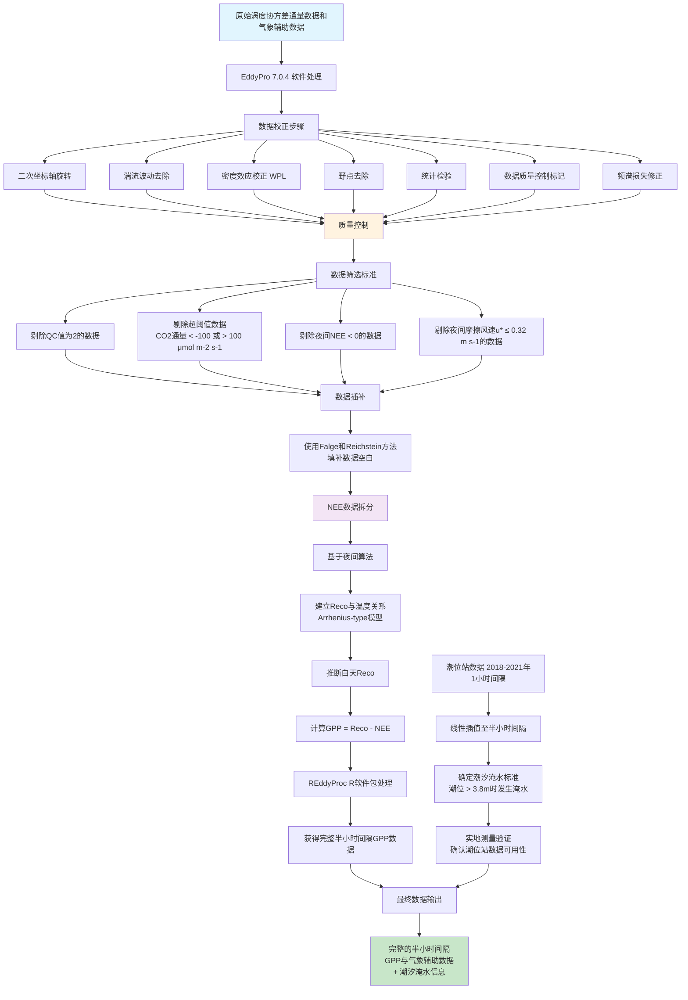

| 地面数据 | GPP    |
| ---- | ------ |
|      | 光合有效辐射 |
|      | 温度     |
|      | 潮高     |
| 遥感   | 植被指数   |
|      | 水体指数   |
|      | 光合有效辐射 |

```mermaid
flowchart TD
    A[原始涡度协方差通量数据和气象辅助数据] --> B[EddyPro 7.0.4 软件处理]
    
    B --> C[数据校正步骤]
    C --> C1[二次坐标轴旋转]
    C --> C2[湍流波动去除]
    C --> C3[密度效应校正 WPL]
    C --> C4[野点去除]
    C --> C5[统计检验]
    C --> C6[数据质量控制标记]
    C --> C7[频谱损失修正]
    
    C1 --> D[质量控制]
    C2 --> D
    C3 --> D
    C4 --> D
    C5 --> D
    C6 --> D
    C7 --> D
    
    D --> E[数据筛选标准]
    E --> E1[剔除QC值为2的数据]
    E --> E2[剔除超阈值数据<br/>CO2通量 < -100 或 > 100 μmol m-2 s-1]
    E --> E3[剔除夜间NEE < 0的数据]
    E --> E4[剔除夜间摩擦风速u* ≤ 0.32 m s-1的数据]
    
    E1 --> F[数据插补]
    E2 --> F
    E3 --> F
    E4 --> F
    
    F --> G[使用Falge和Reichstein方法<br/>填补数据空白]
    
    G --> H[NEE数据拆分]
    H --> I[基于夜间算法]
    I --> J[建立Reco与温度关系<br/>Arrhenius-type模型]
    J --> K[推断白天Reco]
    K --> L[计算GPP = Reco - NEE]
    
    L --> M[REddyProc R软件包处理]
    M --> N[获得完整半小时间隔GPP数据]
    
    O[潮位站数据 2018-2021年<br/>1小时间隔] --> P[线性插值至半小时间隔]
    P --> Q[确定潮汐淹水标准<br/>潮位 > 3.8m时发生淹水]
    Q --> R[实地测量验证<br/>确认潮位站数据可用性]
    
    N --> S[最终数据输出]
    R --> S
    S --> T[完整的半小时间隔<br/>GPP与气象辅助数据<br/>+ 潮汐淹水信息]
    
    style A fill:#e1f5fe
    style T fill:#c8e6c9
    style D fill:#fff3e0
    style H fill:#f3e5f5
```