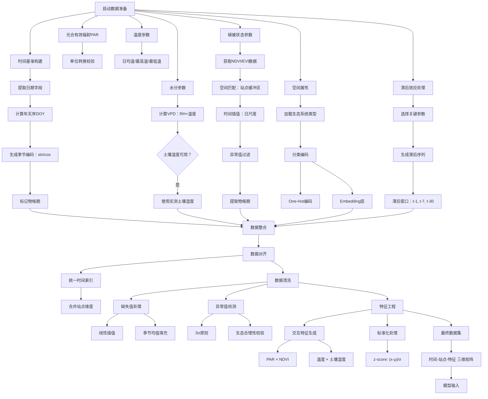
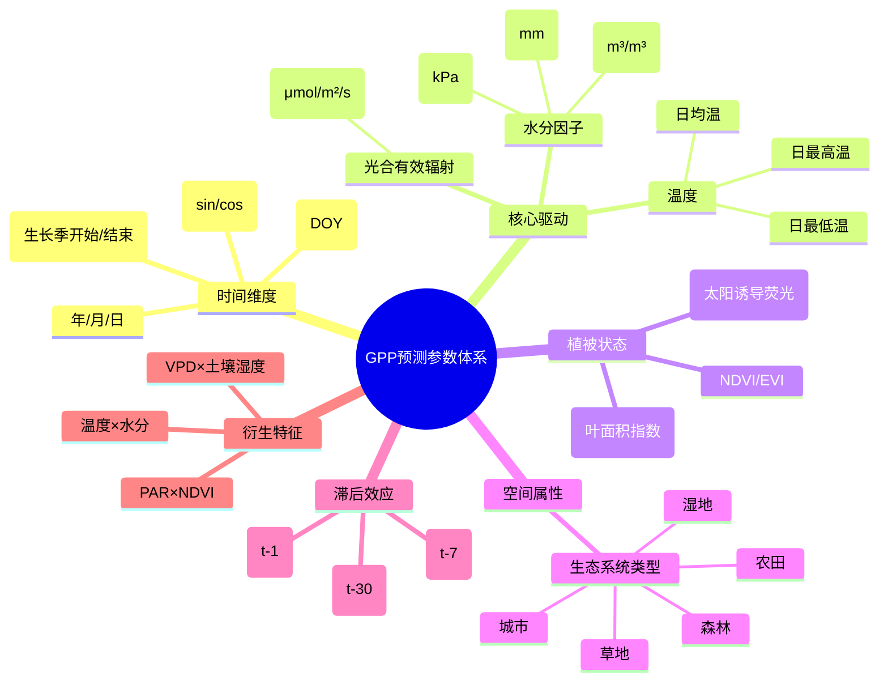
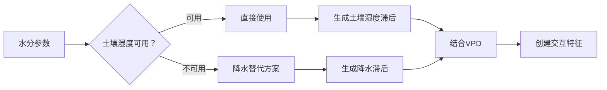

![[Pasted image 20250407141233.png]]
C:\Users\马冲\Zotero\storage\QGPR9DEG
基于集成 学 习 算 法 和 Optuna 调 优 的 江 西 省 森 林 碳 储  量遥感估测

NIR 近波红外
SWIR1 短波红外

![[Pasted image 20250414101237.png]]
Comparing the performance of vegetation indices for improving urban vegetation GPP estimation via eddy covariance flux data and Landsat 5/7 data

![[Pasted image 20250414101623.png]]
光能利用率模型集成机器学习...拟全球生态系统总初级生产力_孔大千

> [!question]
> # 变量选取
> 
> [[01-01-植被指数]]
> [[01-03-纹理特征]]
> [[01-02-地理特征]]

