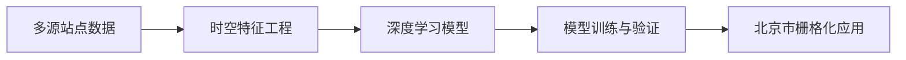

# 第三章 基于时空深度学习的北京市GPP通用模型构建
## 3.1 研究框架与技术路线
3.1.1整体架构

### 3.1.2 创新点
1，时空融合建模 同时捕捉时间动态与空间异质性
2，多生态系统兼容 统一处理多种生态系统
3，特征工程优化 融合物候动态与气象滞后作用

## 3.2 数据准备
### 3.2.1 通量站点数据介绍
### 3.2.2 特征构建策略
1，时间特征 
年天序（当前日期是一年的第多少天） 季节编码 物候期标签 休眠期 生长期
2，气象驱动特征
水汽压差 土壤湿度
3，植被动态
NDVI EVI![[Pasted image 20250414101237.png]]
4，空间属性
5，滞后特征

## 3.3 模型结构

## 3.4 模型训练与评估

