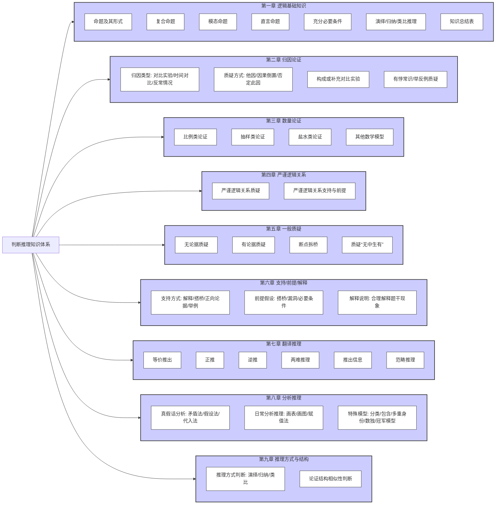

# 第一章 逻辑基础知识 [cite: 21]

### 1.1 命题 [cite: 21]
* 用语言、符号或者式子表达的，可以判断真假的陈述句称为命题，一般写为若p，则q。 [cite: 21]
* 判断为真的语句称为真命题，判断为假的语句称为假命题。 [cite: 21]

#### 1.1.1 命题的四种形式和关系 [cite: 21]
* **原命题**：若p则q [cite: 21]
* **逆命题**：若q则p [cite: 21]
* **否命题**：若非p则非q (讲义中为：若非p则q，但根据逻辑关系图，应为若非p则非q)
* **逆否命题**：若非q则非p (讲义中为：若非q则p，但根据逻辑关系图，应为若非q则非p)
    * *注意：讲义文字描述与关系图有出入，此处按标准逻辑形式及图示调整。根据图示，原命题与逆命题互逆，否命题与逆否命题互逆；原命题与否命题互否，逆命题与逆否命题互否；原命题与逆否命题互为逆否。*
* 原命题与逆否命题的真假是一致的，与否命题和逆命题真假无必然联系。 [cite: 21]
* 逆命题与否命题的真假是一致的，与原命题和逆否命题真假无必然联系。 [cite: 21]

#### 1.1.2 命题的传递规则 [cite: 22]
* A→B, B→C, 可联立, 得出A→C [cite: 22]
* A→B, C→A, 可联立, 得出C→B [cite: 22]
* A→B, 非C→非B (逆否得出B→C), 可联立, 得出A→C [cite: 22]
* A→B, C→B, 不可联立 [cite: 22]
* A→B, A→C, 不可联立 [cite: 22]

#### 1.1.3 命题的真假判断 [cite: 22]
* 对于命题 "p → q" (若p则q):
    * p真，q真 → 命题为真 [cite: 23]
    * p真，q假 → 命题为假 [cite: 23]
    * p假，q真 → 命题为真 [cite: 23]
    * p假，q假 → 命题为真 [cite: 23]

### 1.2 复合命题 [cite: 25]
* 复合命题是指由简单命题用联结词联结而成的命题。 [cite: 25]

#### 1.2.1 联言命题 (且) [cite: 25]
* 反映事物的若干种情况或者性质同时存在的命题，由逻辑联结词“并且”连接，写成p并且q。 [cite: 25]
* **常见指示词**：并且、也、还、同时、“,”等 [cite: 27]
* **矛盾关系**：非(p且q) = 非p或非q [cite: 27]
* **真假判断**：全真为真，一假则假 [cite: 28]

#### 1.2.2 选言命题
* 反映事物的若干种情况或者性质至少有一种存在的命题。 [cite: 28] 可分为相容选言命题和不相容选言命题。 [cite: 28]

##### 1.2.2.1 相容选言命题 (或者) [cite: 29]
* **常见指示词**：或者或者、A和B至少一个、A和B至多一个 [cite: 29]
    * A和B至少1个可翻译为“A或B”。 [cite: 29]
    * A和B至多一个，即非A和非B至少一个，可翻译为“非A或非B”。 [cite: 29]
* **矛盾关系**：非(p或q) = 非p且非q [cite: 29]
* **真假判断**：一真则真，全假为假 [cite: 29]
* **等价规则**：p或q = 非p→q = 非q→p (可记为：“否一推一”) [cite: 29]

##### 1.2.2.2 不相容选言命题 (要么) [cite: 30]
* **常见指示词**：要么要么、A和B二者不可兼得、不是A就是B [cite: 31]
* **矛盾关系**：非(要么p要么q) = (p且q)或(非p且非q) [cite: 31]
* **真假判断**：一真一假为真，全真全假为假 [cite: 31]

#### 1.2.3 假言命题 [cite: 31]
* 陈述某一事物情况是另一件事物情况的条件的命题，假言命题亦称条件命题。 [cite: 31]
* 实质蕴涵：“若A则B”假，当且仅当A真而B假；而当A假时，整个复合命题总是真的。 [cite: 31]

##### 1.2.3.1 关联词之如果那么 [cite: 33]
* **常见指示词**：如果……那么、若……则、只要……就、一……就、所有……都等 [cite: 33]
* **翻译规则**：前推后 (若p则q, 翻译为 p→q) [cite: 33]
* **真假判断**：(p→q) 当且仅当 (p真q假) 时为假。 [cite: 33] (口诀：前件为假命题为真，后件为真命题为真，当且仅当A且非B时为假。) [cite: 33]
* **等价规则**：p→q = 非q→非p = 非p或q (可记为：“否前或后”) [cite: 33]

##### 1.2.3.2 关联词之只有才 [cite: 34]
* **常见指示词**：只有……才、必须……才、才、不……不等 [cite: 34]
* **翻译规则**：后推前 (只有p才q, 翻译为 q→p) [cite: 34] 或 不A不B形式 (只有p才q, 翻译为 非p→非q) [cite: 34]
* 真假判断、等价规则：翻译成“a→b”形式后，同“p→q”。 [cite: 34]

##### 1.2.3.3 关联词之除非否则 [cite: 34]
* **常见指示词**：除非…否则、必须…否则、否则等 [cite: 35]
* **翻译规则**：否A则B (除非p否则q, 翻译为 非p→q) [cite: 35]
* **等价规则**：除非p否则q = 非p→q = p或q [cite: 35]
* 真假判断：翻译成“a→b”形式后，同“p→q”。 [cite: 36]

### 1.3 模态命题 (可能必然) [cite: 37]
* 陈述事物情况的必然性或可能性的命题。 [cite: 37]
* **矛盾关系**：必然 对应 可能不，可能 对应 必然不 (记忆口诀：“两词互换，后面加不”) [cite: 38, 39]
* **推出关系**：必然能推出可能，可能推不出必然 [cite: 38]
* **等价关系**：非必然 = 可能不，非可能 = 必然不 [cite: 38]
* **上反对关系** (必然 vs 必然不): 必有一假 [cite: 40]
* **下反对关系** (可能 vs 可能不): 必有一真 [cite: 40]
* **推理关系图** (方块图) [cite: 40]

### 1.4 直言命题 (所有有些) [cite: 41]
* 断定事物性质的简单命题，亦称“定言命题”或“性质命题”。 [cite: 41]
* **矛盾关系**：非所有 = 有些不，非有些 = 所有不 (记忆口诀：“两词互换，后面加不”) [cite: 41]
* **上反对关系** (所有 vs 所有不): 两个所有必有一假 [cite: 41]
* **下反对关系** (有些 vs 有些不): 两个有些必有一真 [cite: 41]
* **推出关系**：所有→特指→有些；有些p是q→有些q是p；有些p是q推不出有些p不是q [cite: 41]
* **推理关系图** (六边形图) [cite: 42]

### 1.5 充分必要条件 [cite: 43]
* 对于p→q，p是充分条件，q是必要条件。 [cite: 43] 若p能推出q且q能推出p，则p、q互为充分必要条件。 [cite: 43]
* **常见提示词**：
    * 充分条件：如果……那么……、若…则……等 [cite: 43]
    * 必要条件：基础、关键、前提、必须、需要、离不开、必不可少、不可或缺等 [cite: 43]
    * 充分必要条件：当且仅当 [cite: 43]
* **翻译规则**：谁是必要条件谁在箭头后面。 [cite: 43]

### 1.6 演绎推理、归纳推理、类比推理 [cite: 44]
* **演绎推理**：从一般性的前提得出了特殊性的结论的推理。包括三段论、假言推理、选言推理等。 [cite: 44]
* **归纳推理**：从个别到一般，从特殊性的前提推出普遍的一般结论。可分为完全归纳推理、不完全(简单枚举)归纳推理。 [cite: 44]
* **类比推理**：从特殊性的前提得出特殊性的结论。基于两个或两类对象在某些属性上的相同或相似性，推断它们在其他属性上也可能相同或相似。 [cite: 44]
* **三段论推理**：演绎推理中的一种简单推理判断。包含大前提、小前提、结论。 [cite: 44]

### 1.7 知识点总结 [cite: 45]
* **常见提示词翻译表** [cite: 46]
    * p并且q、p和q、p同时q、p也q、p还q、p,q → p且q [cite: 46]
    * p或q、pq至少一个、非p非q至多一个 → p或q [cite: 46]
    * 如果p那么q、若p则q、只要p就q、一p则q、所有p都是q → p→q [cite: 46]
    * 只有p才q、必须p才q、不p不q → q→p [cite: 46]
    * 除非p否则q、必须p否则q、p否则q → 非p→q [cite: 46]
    * q是p的基础/关键/前提、p离不开/必须/需要q、q必不可少/不可或缺 → p→q [cite: 46]
* **各类命题真假判断及推理表** [cite: 47]
    * **联言命题 (p且q)**：
        * 命题为真可推知：p真且q真 [cite: 47]
        * 命题为假可推知：p、q至少一假 [cite: 47]
        * 真假判断：一假则假，全真为真 [cite: 47]
    * **相容选言命题 (p或q)**：
        * 命题为真可推知：p、q至少一真 [cite: 47]
        * 命题为假可推知：p、q均为假 [cite: 47]
        * 真假判断：一真则真，全假为假 [cite: 47]
    * **不相容选言命题 (要么p要么q)**：
        * 命题为真可推知：p、q一真一假 [cite: 47]
        * 命题为假可推知：p、q全假或p、q全真 [cite: 47]
        * 真假判断：一真一假为真，全真全假为假 [cite: 47]
    * **假言命题 (p→q)**：
        * 命题为真可推知：p真q真 或 p假q真 或 p假q假 [cite: 47]
        * 命题为假可推知：p真q假 [cite: 47]
        * 真假判断：p假，命题为真；q真，命题为真；当且仅当p且非q时为假 [cite: 47]
* **直言命题与模态命题总结表** [cite: 48]
    * **直言命题 (所有、有些、特指)**：
        * 推出关系：所有→特指→有些；有些A是B能推出有些B是A [cite: 48]
        * 矛盾关系：两词互换，后面加不 [cite: 48]
    * **模态命题 (可能、必然)**：
        * 推出关系：必然→可能 [cite: 48]
        * 矛盾关系：两词互换，后面加不 [cite: 48] (之前已提)

## 第二章 逻辑论证之归因论证 [cite: 50]

### 2.1 归因论证整体概述 [cite: 50]
* **归因介绍**：人们对他人或自己行为的原因的推论过程，即因果解释和推论。 [cite: 50]
* **题目形式**：一般由对比实验和原因分析(对策建议)或不同平常或过往的既成事实和原因分析两部分组成。 [cite: 50]
* **题型分类**：对比实验归因、一般归因、直接根本原因三类。 [cite: 50]
* **提问方法**：多为“最能削弱”，少数为“最能质疑研究人员的解释”。 [cite: 50]
* **质疑方式**：常见有另有他因、因果倒置、否定此因三种。 [cite: 50]
* **正确和错误选项特征**：正确选项要讨论原因且分组正确；实验瑕疵类（样本数量不足、未全覆盖等）质疑力度很弱；“有些”、特例选项是正确答案概率极低。 [cite: 51]

### 2.2 对比实验归因 [cite: 52]

#### 2.2.1 另有他因质疑 [cite: 52]
* 在题干认为的原有原因之外，增加一个也可能导致结果的原因，从而降低原有原因成立的可能性。 [cite: 52]
* 另有他因选项往往只是“将水搅混”，并非完全否定原有原因。 [cite: 52]
* **正确另有他因选项特征**：回归实验，找到实验组和对照组的另一可能影响结果的不同点。 [cite: 52]
* **归因类题目常见错误选项**：未谈论原因、未分组的典型伪他因、“有些”类选项、实验瑕疵类选项。 [cite: 52]

##### 2.2.1.1 “继发关联”的另有他因 [cite: 55]
* 指A与B不存在因果关联，A与B均是其共同原因C导致的结果。 [cite: 55]

##### 2.2.1.2 利用分组正确找到另有他因选项 [cite: 57]
* 题干中有多种实验分组方式时，根据最终的结论确定实验组和对照组，并根据正确的分组找出另有他因选项。 [cite: 57]

#### 2.2.2 因果倒置质疑 [cite: 58]
* 把原因和结果相互颠倒，视结果为原因和视原因为结果而引起的谬误。 [cite: 58]

##### 2.2.2.1 因果倒置和另有他因力度比较 [cite: 60]
* (具体比较力度讲义中未详细展开文字说明，通过例题体现)

#### 2.2.3 否定此因质疑 [cite: 60]
* 不探讨题干中某结果的原因是什么，只否认题干中认定的原因。 [cite: 60]

#### 2.2.4 排除他因支持 [cite: 61]
* 排除其他可能影响结果的原因的可能性，让题干中认定的原因成为唯一的可能原因，从而进行支持。 [cite: 61]

### 2.3 时间对比归因 [cite: 63]
* 当前与以往相比出现某种变化，并找到此种变化的可能原因。 [cite: 63]
* 可通过找到当前与过去的另一点不同，来进行他因削弱。 [cite: 63]
* 注意：一直存在且无变化的事实不会是某种变化的原因，“变化”才是“变化”的原因。 [cite: 63]

### 2.4 反常情况归因 [cite: 65]
* 为不同于正常情况的反常情况寻找原因。 [cite: 65]

### 2.5 直接根本原因 [cite: 66]
* 一种固定题型，一般由原观点、反对者观点组成，多数设问为质疑反对者。 [cite: 66]
* 正确答案一般为“原观点认为的原因”导致了“反对者认为的原因”，即原观点是根本原因，反对者是直接原因。 [cite: 66]

### 2.6 构成或补充对比实验 [cite: 67]

#### 2.6.1 构成对比实验 [cite: 67]
* 选项与题干分别为实验组和对照组，通过“异因异果”进行支持(四圈支持)或通过“异因同果”/“同因异果”进行质疑(三圈质疑)。 [cite: 67]

##### 2.6.1.1 四圈支持 [cite: 68]
* (通过“异因异果”进行支持) [cite: 67]

##### 2.6.1.2 三圈质疑 [cite: 69]
* (通过“异因同果”/“同因异果”进行质疑) [cite: 67]

#### 2.6.2 补充对比实验 [cite: 70]
* 选项本身即是一个对比实验，通过对比实验结果进行支持或削弱。 [cite: 70]

### 2.7 归因论证有悖常识结论的质疑 [cite: 71]
* (针对结论明显与普遍常识相悖的归因论证进行质疑)

### 2.8 归因论证的举反例质疑 [cite: 72]
* (通过举出反面例子来削弱归因论证的观点)

## 第三章 逻辑论证之数量论证 [cite: 73]
* **数量论证**：一种“数学+逻辑”的综合题目，题干中存在的逻辑漏洞和数学知识有关。 [cite: 73]

### 3.1 比例类论证 [cite: 73]
* 常犯的逻辑错误是用“分子的多少”代替“分子/分母的比例”得出结论。 [cite: 73]
* 题干往往包含数字(分子部分)，选项中需找到带“数字”的分母部分。 [cite: 73]

### 3.2 抽样类论证 [cite: 76]
* 常犯的逻辑错误是从某一特殊群体中抽样，该群体并不能代表整体情况。 [cite: 76]

### 3.3 盐水类论证 [cite: 77]
* 可看成盐水问题，混合浓度要在两部分浓度之间。 [cite: 77]

### 3.4 其他数学模型 [cite: 79]

#### 3.4.1 容斥交集 [cite: 79]
* (应用容斥原理进行论证或反驳)

#### 3.4.2 人数人次 [cite: 79]
* (区分人数和人次的概念，避免混淆导致的错误论证)

#### 3.4.3 乘积模型 [cite: 80]
* (涉及总量由多个因素乘积决定的模型，如销售额=销量×单价)

#### 3.4.4 分数大小变化 [cite: 80]
* (涉及对分数、比例变化的理解和比较，如发病率=发病人数/总人数)

## 第四章 逻辑论证之严谨逻辑关系 [cite: 82]
* **严谨逻辑关系**：一种“形式逻辑+论证”的综合题目，题干中存在逻辑关联词，可先翻译再解题。 [cite: 82]

### 4.1 严谨逻辑关系的一般质疑 [cite: 82]
* 若题干结论可翻译为A→B，可在选项中寻找A且非B进行质疑。 [cite: 82]
* 少数题目可用A→非B代替A且非B进行质疑。 [cite: 82]

#### 4.1.1 “A且非B”质疑A→B [cite: 82]
* (寻找A成立但B不成立的情况来削弱A→B的结论)

#### 4.1.2 “A→非B”质疑A→B [cite: 83]
* (寻找A成立但B的否定成立的情况来削弱A→B的结论，此表述可能与4.1中“少数题目可用A→非B代替A且非B”对应，但标题重复，应理解为一种质疑方式)

### 4.2 严谨逻辑关系的支持与前提假设 [cite: 85]

#### 4.2.1 “A→B”搭桥A和B [cite: 85]
* 若题干存在断点且选项包含逻辑关联词，可在选项中寻找“A→B”搭桥断点A、B。 [cite: 85]

#### 4.2.2 三段论的必要前提 [cite: 87]
* 三段论推理包含大前提、小前提和结论。 [cite: 87]
* 解题技巧：①所有+有些=有些，②是+是=是、是+否=否，③三种概念各出现两次。 [cite: 87]

## 第五章 逻辑论证之一般质疑 [cite: 89]

### 5.1 无论据有结论的一般质疑 [cite: 89]
* 题干常由“背景、分析和结论”组成，常用提出反向论据的方式反驳论点。 [cite: 89]
* 注意话题一致，主体正确，贴合题干。 [cite: 89]

### 5.2 有论据有结论的一般质疑 [cite: 90]

#### 5.2.1 质疑论据 [cite: 90]
* 当论据存在错误时，可通过指出论据问题质疑。 [cite: 90]
* 论据是个人观点、个人判断时，可能存在论据有误的错误。 [cite: 90]

#### 5.2.2 增加反向论据 [cite: 92]
* 题干可能通过一些有利因素得出积极结论或不利因素得出消极结论（考虑不全面），或因少数样本得出普遍结论（以偏概全）。 [cite: 92]
* 针对上述问题，可通过增加反向论据进行质疑。 [cite: 92]

##### 5.2.2.1 个例的认定 [cite: 95]
* (指通过特定个例来质疑或支持普遍性结论的有效性)

#### 5.2.3 断点拆桥 [cite: 96]
* 若题干的论据和结论并不十分相关，根据论据推不出结论，犯了“推不出”的错误，可通过拆桥进行质疑。 [cite: 96]

#### 5.2.4 质疑结论中的“无中生有” [cite: 98]
* 若题干结论中出现了程度较重的“无中生有”内容，可重点关注，进行质疑。 [cite: 98]

## 第六章 逻辑论证之支持、前提、解释 [cite: 99]

### 6.1 支持、前提假设、解释说明的整体概述 [cite: 99]
* **常见问法**：支持（最能加强/支持）、前提假设（需要补充的前提/隐含的假设）、解释说明（最能解释）。 [cite: 99]
* **支持类常见支持方式**：解释说明、断点搭桥、增加正向论据、必要条件、举例支持等。 [cite: 99]
* **前提假设类常见选项形式**：断点搭桥、补充漏洞、必要条件。 [cite: 99]
* **解释说明类**：为题干中“让人费解”的现象找到合理的理由，理由不能像借口，越能让人接受越好。正确选项往往是出题人故意未提及且大家也容易忽略的合理事实。 [cite: 99]
* 前提假设可看作“特殊支持类”。 [cite: 99]
* 解释也可看作“特殊支持类”。 [cite: 99]

### 6.2 五种常见支持方式 [cite: 99]

#### 6.2.1 解释说明 [cite: 99]
* 解释了为什么得到此结论，读懂了该选项应有豁然开朗之感。 [cite: 99]

#### 6.2.2 断点搭桥 [cite: 101]
* 若题干的结论中存在论据没有的“新内容”，此新内容一定在选项中要有所体现，并能够和论据中的关键信息进行搭桥。 [cite: 101]

#### 6.2.3 增加正向论据 [cite: 102]
* 若题干论证存在漏洞，可通过增加正向论据补充漏洞；若论证过程较完整，也可通过增加数据、事实等正向论据进行支持。 [cite: 102]

#### 6.2.4 必要条件 (反向代入) [cite: 104]
* 选项是结论成立的必要前提，“没他不行”。 [cite: 104]
* 可采用反向代入验证：若实际情况与选项相反，则必然得不出题干结论。 [cite: 104]

#### 6.2.5 举例支持 [cite: 105]
* (通过举出具体例子来支持题干的论点或发现)

### 6.X 变化/比较的支持方式 [cite: 106]
* 用“变化”支持“变化”，比较尽量说“两边”。 [cite: 106]

### 6.Y 三种常见的前提假设 [cite: 108]

#### 6.Y.1 断点搭桥 [cite: 108]
* (同支持类中的断点搭桥，作为前提假设的形式出现)

#### 6.Y.2 补充漏洞 [cite: 110]
* (类似支持类中的增加正向论据，用于弥补论证过程的缺陷)

#### 6.Y.3 必要条件/能与不能 [cite: 111]
* (作为结论成立所必须依赖的条件或能力判断)

### 6.Z 解释说明类 [cite: 112]
* (为题干中看似矛盾或不寻常的现象提供合理解释)

## 第七章 翻译推理 [cite: 115]
* 等价推出、根据已知事实正推、根据所需结果逆推、两难推理、推出信息、范畴推理。

### 7.1 等价推出 [cite: 115]
* 将题干逻辑关系和选项逻辑关系分别翻译后，二者完全一致。 [cite: 115] 考察翻译规则、命题传递、原命题与逆否命题等价。 [cite: 115]
* 翻译规则表 (已在1.7中总结) [cite: 116]

#### 7.1.1 与题干等价 [cite: 117]
* 解题技巧：若题干为A→B，可翻译为A→B或非B→非A为正确选项。以B或非A开头的选项可先排除。若题干有多个逻辑句，答案可能只和一句有关。 [cite: 117]

#### 7.1.2 与题干不等价 [cite: 90]
* 解题技巧：若题干只有一个逻辑关系，可直接翻译选项，选项三个相同一个不同，选不同的。 [cite: 90]

### 7.2 根据已知事实正推 [cite: 91]
* 无需将题干多个命题联立，根据已知事实，按逻辑传递规则推出。 [cite: 91]

### 7.3 根据所需结果逆推 [cite: 93]
* 要想得到C (由B→C)，需B成立；要想得到B (由A→B)，需A成立，一步步逆推。常考“p或q”的“否一推一”。 [cite: 93]

### 7.4 两难推理 [cite: 94]
* 解题方法：A→B、非A→B，可推出B成立； A→B、A→非B，可推出非A成立。 [cite: 94]

### 7.5 推出信息 [cite: 96]
* 根据所给命题的真假，判定选项命题或事实的真假。 [cite: 96]

### 7.6 题型分类梳理 [cite: 98]
* **等价推出**：题干为单个或多个命题，选项为命题，思路为翻译后找等价。 [cite: 98]
* **正推**：题干为命题+已知事实，选项为事实，思路为命题联立和逻辑传递。 [cite: 98]
* **逆推**：题干为命题+需要结果，选项为事实，思路为命题联立和逻辑传递。 [cite: 98]
* **两难推理**：题干为多个命题，选项为事实，思路为两难推理规则。 [cite: 98]
* **推出信息**：题干为命题，选项为命题或事实，思路为根据命题真假判定信息。 [cite: 98]

### 7.7 范畴推理 [cite: 130]
* 根据直言命题（所有、有些、特指）之间关系和性质进行推理，也包括判定集合关系。 [cite: 130]
* 相关知识点：对当关系图 (已在1.4中涉及) [cite: 130]

#### 7.7.1 直言命题考察 [cite: 130]
* (运用直言命题的对当关系、换位法等进行推理)

#### 7.7.2 集合关系考察 [cite: 132]
* (运用文氏图或集合论思想分析不同概念外延间的关系)

## 第八章 分析推理 [cite: 135]

### 8.1 真假话分析推理 [cite: 135]
* 常用方法：矛盾法、假设法、代入法。

#### 8.1.1 矛盾法 [cite: 135]
* 三种矛盾关系：①A 和非 A、A 且 B 和非 A 或非 B、A 或 B 和非 A 且非 B；②所有和有些不，有些和所有不、可能和必然不、必然和可能不；③A→B 和 A 且非 B。 [cite: 135]

#### 8.1.2 假设法 [cite: 138]
* (当找不到明显矛盾或反对关系时，假设某个条件为真或为假，代入其他条件看是否产生矛盾)

#### 8.1.3 代入法 [cite: 139]
* (将选项代入题干条件进行验证)

#### 8.1.4 命题的真假判断 [cite: 140]
* 常用知识点：对于 A→B，①只有 A 且非 B 时命题为假，②A 为假（前件为假）命题为真，③B 为真（后件为真）命题为真。 [cite: 140]

#### 8.1.5 两真两假模型 [cite: 142]
* (题目中明确告知若干陈述中有几真几假，通过寻找关系命题（矛盾、上下反对等）进行突破)

### 8.2 日常分析推理 [cite: 143]
* 给出日常生活中蕴含逻辑关系的若干条件，需抽丝剥茧找到其内在联系并适当推理。 [cite: 143]
* 常用方法：代入法、画表法、画图法、赋值法等。 [cite: 143]
* 解题入手点：一般可以从确定信息、最大信息入手。 [cite: 143]

#### 8.2.1 画表法 [cite: 143]
* (将题干涉及的元素及其属性列成表格，根据条件填表排除)

#### 8.2.2 画图法 [cite: 144]
* (针对涉及位置关系、顺序关系等题目，用图形辅助分析)

#### 8.2.3 赋值法 [cite: 145]
* (对题中某些量赋以特殊值或相对大小，帮助推理)

#### 8.2.4 特殊思维 [cite: 146]

##### 8.2.4.1 等价思维 [cite: 146]
* (将复杂条件转化为等价的简单形式)

##### 8.2.4.2 极限思维 [cite: 147]
* (考虑极端情况来缩小范围或得出结论)

#### 8.2.5 特殊模型 [cite: 147]

##### 8.2.5.1 不同角度分类模型 [cite: 147]
* (题干对同一集合从不同标准进行分类，需要整合信息)

##### 8.2.5.2 包含关系模型 [cite: 148]
* (分析不同集合之间的包含、交叉、全异等关系，常涉及最值问题)

##### 8.2.5.3 多重身份模型 [cite: 148]
* (同一主体具有多个属性或属于多个不同类别，需要匹配)

##### 8.2.5.4 数独模型 [cite: 149]
* (类似数独的填表，每行每列元素不重复)

##### 8.2.5.5 冠军模型 [cite: 150]
* (若干预测中只有一个正确，判断谁是冠军或某事结果)

## 第九章 推理方式与论证结构 [cite: 151]

### 9.1 推理方式判断 [cite: 151]
* 多考察归纳推理的判断，要注意完全归纳（可以是两个子类）与不完全归纳。 [cite: 151] (也包括演绎推理和类比推理的判断)

### 9.2 论证结构或错误相似 [cite: 152]
* (要求找出与题干具有相同论证结构、推理形式或犯有类似逻辑错误的选项)

